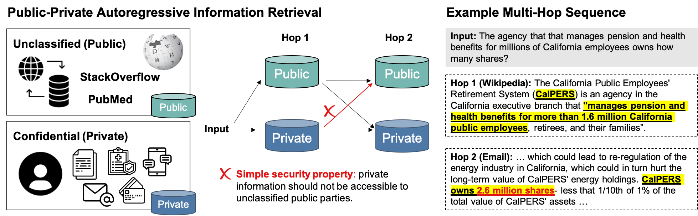

# Reasoning over Public and Private Data in Retrieval-Based Systems

Simran Arora, Patrick Lewis, Angela Fan, Jacob Kahn*, Christopher Ré*

[**Paper**](https://arxiv.org/abs/2203.11027)
| [**Blog Post**](https://ai.facebook.com/blog/building-systems-to-reason-securely-over-private-data)
| [**Download**](#getting-the-dataset)
| [**Citing**](#citation)

This repository contains dataset resources and code for ConcurrentQA, a textual QA benchmark to require concurrent retrieval over multiple data-distributions and privacy scopes. It also contains result analysis code and other resources for research in the private QA setting.

<p align="center"></p>


### Getting the ConcurrentQA Dataset and Model Checkpoints
To download train, dev, and test sets along with email and Wikipedia passage corpora, and model checkpoints, run:
```bash
bash scripts/download_cqa.sh
```

To download retriever and reader models trained on HotpotQA data, run:
```bash
bash scripts/download_hotpot.sh
```

### Set up
Please follow the environment set up instructions in ```MDR_PAIR/README.md'''. 


### Code
We include instructions 1) for training and evaluating models on ConcurrentQA data in the absense of privacy cocerns and 2) for evaluating performance under the PAIR privacy framework.

#### Training Models on ConcurrentQA
To run evaluation with provided model checkpoints, use the script:  
```bash
cd MDR_PAIR
bash CQA_Scripts/MDR_Eval_CQA.sh
```

```
Retrieval scores on test split ...
	Avg PR: 0.604375
	Avg P-EM: 0.190625
	Avg 1-Recall: 0.276875
	Path Recall: 0.184375
bridge Questions num: 1400
	Avg PR: 0.5985714285714285
	Avg P-EM: 0.18785714285714286
	Avg 1-Recall: 0.265
	Path Recall: 0.18428571428571427
comparison Questions num: 200
	Avg PR: 0.645
	Avg P-EM: 0.21
	Avg 1-Recall: 0.36
	Path Recall: 0.185

Reader scores on test split ... 
      'em': 0.48875, 
      'f1': 0.5650013858314458, 
      'joint_em': 0.1175, 
      'joint_f1': 0.3439091595024459, 
      'sp_em': 0.154375, 
      'sp_f1': 0.4496642766955267
```

To train your own MDR model from scratch, use the script: 
```bash
cd MDR_PAIR
bash CQA_Scripts/MDR_end2end_CQA.sh
```

#### Evaluating QA Performance Under PAIR Framework
Set the desired privacy mode and retrieval mode in the script and run as follows: 
```bash
cd MDR_PAIR
bash CQA_Scripts/MDR_PairBaselines.sh
```

Descriptions of privacy and retrieval modes are included in the script.
- Privacy modes include preserving document privacy (DOC_PRIVACY), query privacy (QUERY_PRIVACY), and no privacy.
- Retrieval modes include ranking the OVERALL top k after each hop (4combo_overallrank), selecting the top passages from EACH DOMAIN after each hop (4combo_separaterank).


## Citation
Please use the following Bibtex when using the dataset:
```
@misc{arora2022reasoning,
      title={Reasoning over Public and Private Data in Retrieval-Based Systems}, 
      author={Simran Arora and Patrick Lewis and Angela Fan and Jacob Kahn and Christopher Ré},
      year={2022},
      eprint={2203.11027},
      archivePrefix={arXiv},
      primaryClass={cs.IR}
}
```

If you use MDR, please also cite the [Multi-Hop Dense Text Retrieval](https://github.com/facebookresearch/multihop_dense_retrieval) work.

## License
ConcurrentQA and related code is under an MIT license. See [LICENSE](LICENSE) for more information.
